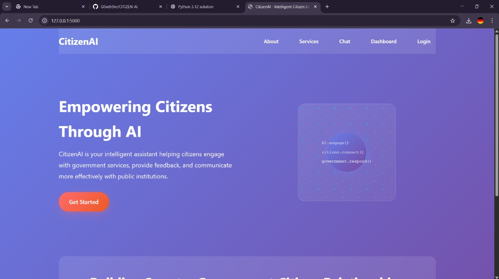
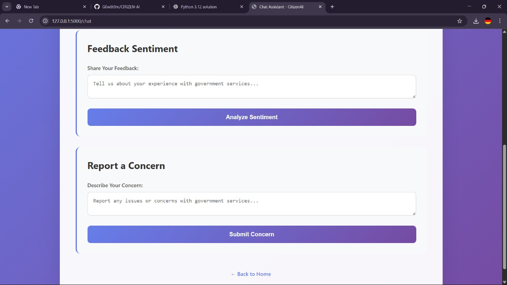
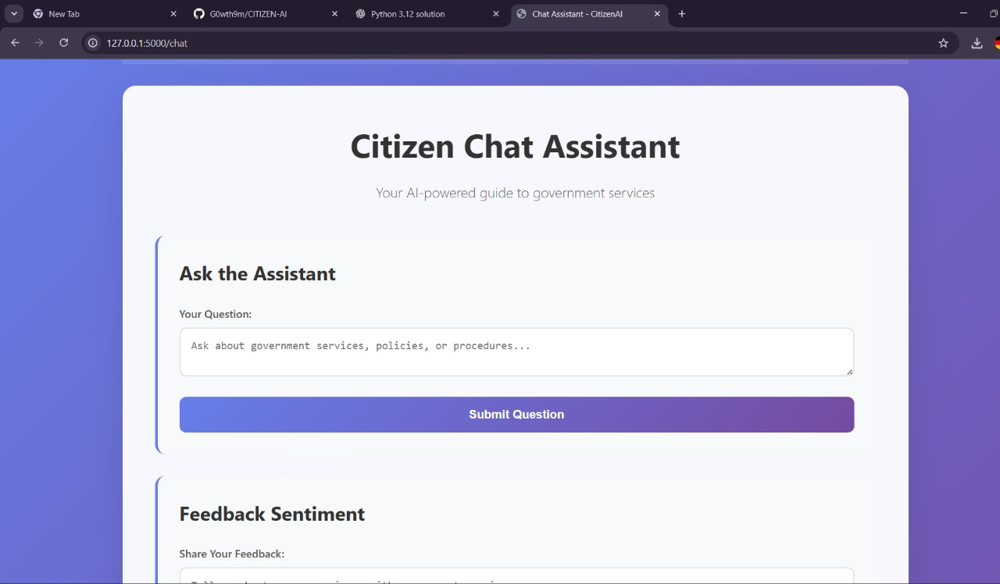
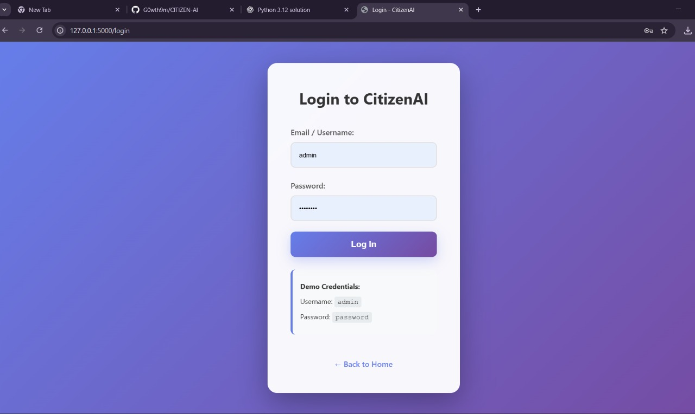

# 🤖 CitizenAI - Intelligent Citizen Engagement Platform

CitizenAI is an intelligent citizen engagement platform designed to revolutionize how governments interact with the public. Leveraging Flask, IBM Granite models, and IBM Watson, CitizenAI provides real-time, AI-driven responses to citizen inquiries regarding government services, policies, and civic issues.
## Screenshots







## 🚀 Quick Start

```bash
# Install dependencies
pip install -r requirements.txt

# Run demo version (lightweight)
python app_demo.py

# Or run full AI version
python app.py

# Access at: http://localhost:5000
# Login: admin / password
```

## ✨ Key Features

- **💬 AI Chat Assistant** - Real-time conversational AI using IBM Granite models
- **🧠 Sentiment Analysis** - Automatic feedback classification and trend analysis  
- **📊 Analytics Dashboard** - Real-time visualizations with interactive charts
- **⚠️ Concern Reporting** - Issue submission and tracking system
- **🔐 User Authentication** - Secure session-based authentication
- **📱 Responsive Design** - Modern UI that works on all devices

## 📚 Documentation

Complete documentation is available in the [`docs/`](docs/) folder:

- **📋 [Setup Guide](docs/SETUP.md)** - Installation and configuration
- **🏗️ [Build Progress](docs/BUILD_PROGRESS.md)** - Development timeline and milestones
- **🚀 [Deployment Guide](docs/DEPLOYMENT.md)** - Production deployment instructions
- **🔧 [API Reference](docs/API_REFERENCE.md)** - Complete API documentation
- **🐛 [Dashboard Fixes](docs/DASHBOARD_FIXES.md)** - Technical fixes and improvements
- **📖 [Documentation Index](docs/README.md)** - Complete documentation overview

## 🛠️ Technology Stack

- **Backend**: Python 3.11, Flask 3.0
- **AI/ML**: PyTorch, Transformers, IBM Granite 3.0-3B
- **Frontend**: HTML5, CSS3, JavaScript, Chart.js  
- **Data**: In-memory storage (PostgreSQL ready)
- **Deployment**: Docker, Kubernetes, AWS/Azure/GCP

## 📁 Project Structure

```
CitizenAI/
├── 📁 docs/                    # Complete documentation
├── 📁 templates/              # HTML templates (6 pages)
├── 📁 static/css/             # Modern CSS styling
├── 📄 app.py                  # Main Flask application
├── 📄 app_demo.py             # Lightweight demo version
├── 📄 requirements.txt        # Python dependencies
└── 📄 README.md               # This file
```

## 🎯 Use Cases

1. **Government Services** - Citizens can ask questions about permits, licenses, and procedures
2. **Feedback Collection** - Real-time sentiment analysis of citizen feedback  
3. **Issue Reporting** - Streamlined concern submission and tracking
4. **Analytics** - Government insights into citizen engagement and satisfaction

## 💡 Getting Started

1. **Installation**: Follow the [Setup Guide](docs/SETUP.md)
2. **Demo**: Run `python app_demo.py` for immediate testing
3. **Full Version**: Run `python app.py` for complete AI capabilities
4. **Documentation**: Explore the [`docs/`](docs/) folder for detailed guides

## 📞 Support

- **📋 Setup Issues**: Check [Setup Guide](docs/SETUP.md)
- **🔧 API Questions**: See [API Reference](docs/API_REFERENCE.md)  
- **🚀 Deployment**: Follow [Deployment Guide](docs/DEPLOYMENT.md)
- **🐛 Bug Reports**: Review [Dashboard Fixes](docs/DASHBOARD_FIXES.md)

## 📄 License

This project is licensed under the terms specified in the [LICENSE](LICENSE) file.

---

**CitizenAI - Empowering Citizens Through AI** 🚀

*Building smarter government-citizen relationships with intelligent technology.* – Intelligent Citizen Engagement Platform

**CitizenAI** is an intelligent conversational AI platform that enables governments to deliver smarter, faster, and more transparent services to citizens. Built with **Flask**, **IBM Granite models**, and **Hugging Face Transformers**, the platform provides real-time assistance, sentiment analysis, and actionable insights.

## 📌 Table of Contents

- [🇮🇳 CitizenAI – Intelligent Citizen Engagement Platform](#-citizenai--intelligent-citizen-engagement-platform)
  - [📌 Table of Contents](#-table-of-contents)
  - [🚀 Project Overview](#-project-overview)
  - [🎯 Key Features](#-key-features)
  - [🧠 AI Capabilities](#-ai-capabilities)
  - [🧰 Tech Stack](#-tech-stack)
  - [🧱 Project Structure](#-project-structure)
  - [⚙️ Prerequisites](#️-prerequisites)
  - [🛠️ Installation \& Setup](#️-installation--setup)
  - [📊 Dashboard View](#-dashboard-view)
  - [💻 Development Plan (Milestones)](#-development-plan-milestones)
    - [✅ Milestone 1: Project Setup \& Architecture](#-milestone-1-project-setup--architecture)
    - [✅ Milestone 2: Core Backend Functionalities](#-milestone-2-core-backend-functionalities)
    - [✅ Milestone 3: Application Logic \& Data Handling](#-milestone-3-application-logic--data-handling)
    - [✅ Milestone 4: Frontend Development](#-milestone-4-frontend-development)
    - [✅ Milestone 5: Integration \& Testing](#-milestone-5-integration--testing)
    - [🔄 Milestone 6: (Optional) Deployment Preparation](#-milestone-6-optional-deployment-preparation)
  - [📌 Future Enhancements](#-future-enhancements)
  - [📝 License](#-license)
  - [🙌 Acknowledgments](#-acknowledgments)

## 🚀 Project Overview

CitizenAI bridges the gap between citizens and government services through real-time AI responses, feedback analytics, and issue reporting. The platform allows:
- Citizens to interact naturally with a smart assistant.
- Governments to monitor public sentiment and concerns.
- Officials to take data-driven actions for improved service delivery.

## 🎯 Key Features

| Feature | Description |
|--------|-------------|
| 💬 Conversational Assistant | Ask questions and get instant answers from a Granite LLM. |
| 🧠 Sentiment Analysis | Analyze feedback and classify it as Positive, Neutral, or Negative. |
| ⚠️ Concern Reporting | Report civic issues and submit concerns for follow-up. |
| 📊 Dynamic Dashboard | View sentiment trends and reported concerns in real-time. |
| 🔐 User Authentication | Login/logout flow for restricted access to dashboards. |

---

## 🧠 AI Capabilities

Powered by [IBM Granite Foundation Models](https://huggingface.co/ibm), CitizenAI integrates:

- **Natural Language Understanding (NLU)**
- **Text Generation**
- **Sentiment Classification**

These are served via `transformers`, `accelerate`, and `bitsandbytes` for efficient inference.

## 🧰 Tech Stack

| Layer        | Tech |
|-------------|------|
| Backend      | Python 3.10, Flask |
| AI Models    | IBM Granite (via Hugging Face Transformers) |
| Frontend     | HTML5, CSS3, Jinja2 |
| AI Runtime   | PyTorch, Accelerate, BitsAndBytes |
| Deployment   | (To be configured) Render / Heroku / Railway |

---

## 🧱 Project Structure

```

CitizenAI/
│
├── app.py                     # Flask app routes and logic
├── templates/                 # HTML templates (Jinja2)
│   ├── index.html
│   ├── login.html
│   ├── about.html
│   ├── services.html
│   ├── chat.html
│   ├── dashboard.html
│
├── static/
│   ├── css/styles.css         # Global styles
│   ├── Images/                # Static images
│   └── Favicon/               # Favicon
│
├── models/                    # (Optional) Model abstraction code
├── utils/                     # Sentiment analysis, AI helpers
├── requirements.txt           # Dependency list
└── README.md                  # Project documentation

```

## ⚙️ Prerequisites

- Python 3.7 or higher
- pip (Python package installer)
- At least **16 GB RAM**
- Optional: NVIDIA GPU with **8+ GB VRAM** (Recommended for inference)
- CUDA drivers installed for GPU acceleration
- Active internet connection (first run downloads models)

## 🛠️ Installation & Setup

```bash
# 1. Clone the repo
git clone https://github.com/AkhileshMalthi/citizen-ai.git
cd citizen-ai

# 2. Create and activate a virtual environment
python -m venv venv
source venv/bin/activate  # On Windows: venv\Scripts\activate

# 3. Install dependencies
pip install -r requirements.txt

# 4. Run the app
python app.py
# Or using Flask's dev server
flask run
```

## 📊 Dashboard View

The `/dashboard` route shows:

* ✅ **Sentiment Counts** (Positive, Neutral, Negative)
* 🧾 **List of Concerns** submitted by citizens
* 📈 (Planned) Time-series trends and charts

## 💻 Development Plan (Milestones)

### ✅ Milestone 1: Project Setup & Architecture

* Confirm IBM Granite model via Hugging Face
* Install libraries: `Flask`, `torch`, `transformers`, `accelerate`, `bitsandbytes`
* Design architecture: Flask backend, AI layer, frontend UI

### ✅ Milestone 2: Core Backend Functionalities

* Define Flask routes: `/`, `/about`, `/services`, `/chat`, `/dashboard`, `/login`, `/logout`
* Implement:

  * `ask_question()` → invokes LLM
  * `submit_feedback()` → invokes sentiment analysis
  * `report_concern()` → stores concern
* Session-based login/logout handling

### ✅ Milestone 3: Application Logic & Data Handling

* Use in-memory lists for:

  * Chat history
  * Sentiment logs
  * Reported concerns
* Format data for dashboard display
* Return AI responses to templates

### ✅ Milestone 4: Frontend Development

* HTML pages:

  * `chat.html`, `login.html`, `dashboard.html`, etc.
* Forms for:

  * Chat question
  * Feedback sentiment
  * Concern submission
* Jinja2 templating to display:

  * AI responses
  * Sentiment results
  * Concern confirmation
  * Dashboard analytics

### ✅ Milestone 5: Integration & Testing

* Ensure all routes and forms are functional
* Validate user flow:

  * Login → Chat → Feedback → Concern → Dashboard → Logout
* Error handling and success feedback

### 🔄 Milestone 6: (Optional) Deployment Preparation

* Add persistent DB (e.g., SQLite with SQLAlchemy)
* Add admin roles
* Package into Docker container
* Deploy to Render / Railway / Heroku

## 📌 Future Enhancements

* 📊 Visual Dashboard using Chart.js
* 🧾 Persistent storage with PostgreSQL or SQLite
* 🌍 Multilingual support with translation APIs
* 🔒 JWT-based login authentication
* 📬 Email notifications for reported concerns
* 🎯 Granular user roles: admin, citizen, analyst
* 🌐 Responsive UI using Bootstrap or TailwindCSS
* 🛡️ Security: CSRF protection, rate limiting

## 📝 License

This project is licensed under the MIT License. See `LICENSE` file for details.

## 🙌 Acknowledgments

* IBM Granite team and Hugging Face
* Flask & PyTorch community
* Open-source contributors
